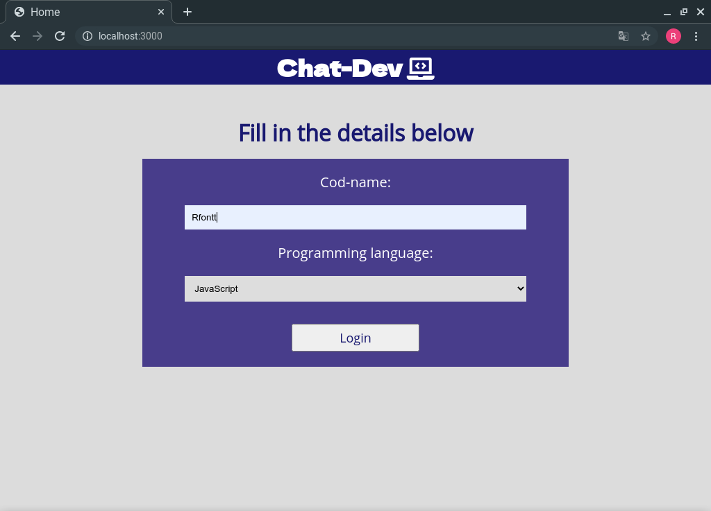
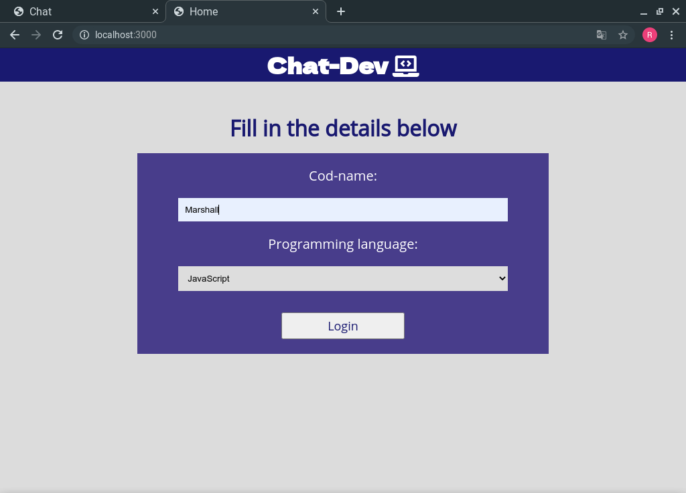
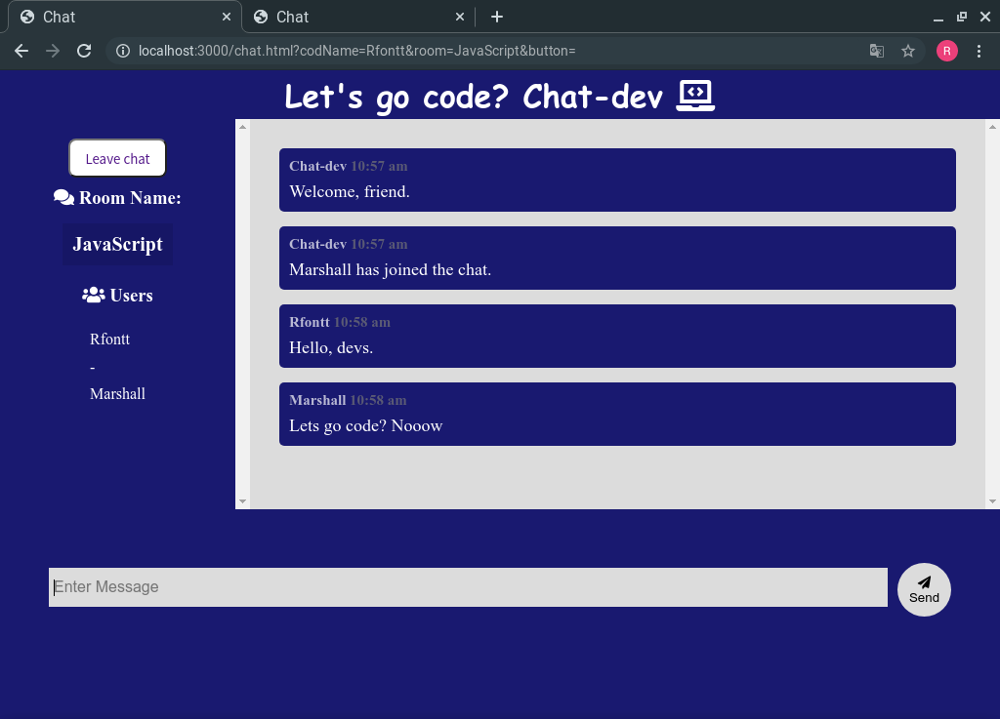

# Sobre o projeto:

Esse projeto foi feito especialmente para o meu aprendizado de websockets. Os conceitos de room e eventos ficaram totalmentes compreendidos.

# Tecnologias:

- Node;
- JS puro.

# Imagens do projeto:








# websockets:

No mundo da web, nem sempre tivemos a comunicação em tempo real(real-time), porém com a vinda dos websockets, hoje temos essa possibilidade. Nesse projeto você vai conhecer como trabalhar com troca de informações entre o servidor e o cliente, também vai entender como funciona as room do socket.io e o emit.

### Room e emit:

Nesse projeto, em específico, trabalhamos com a room. Imagine que ela seja uma casa em que possui uma determinada familia, ela pode receber visistas, as visitas podem sair quando quiser e as trocas de informações passadas nela não são ouvidas em outras casas.

- src/util/message:

> Aqui nós formatamos as informações que serão padrão na aplicação. Quando enviado alguma mensagem, esse padrão será exposto na tela.

> A função FormatMessage recebe dois parâmetros, os quais serão enviadas do cliente para o servidor que repassa para ela, tais parâmetros são: codName, text. O time será padronizado com a lib moment, a qual trata-se de formatos de datas.

```
function FormatMessage(codName, text) {
  return {
    codName,
    text,
    time: moment().format('h:mm a')
  }
}
```

- src/server.js:

**const socket = require('socket.io'); // Voltado para ações do cliente para o servidor.**
**const io = socket(server); // Voltado para ações do servidor para o cliente.**

> Aqui temos a primeira ação do servidor: verificar quem está conectado. Com a conexão estabelecida, o sevidor emite para o cliente uma mensagem padrão(um bot) dando boas-vindas ao usuário. Ademais, ele emite uma mensagem sempre que um novo usuário se conecta.

```
io.on('connection', socket => {
    socket.emit('message', FormatMessage(botName, 'Welcome, friend.'));
    socket.broadcast.emit('message', FormatMessage(botName,  'User has joined the chat.'));
  });
```

**Dessa forma, precisamos apenas capturar esse valor no cliente.**

- src/public/js/main.js:

> O socket vai ouvir um evento nomeado como message, o mesmo que criamos no server(o server está o emitindo). Ao ouvir esse evento, chamará uma função recebendo como parâmetro o obejeto que passamos no server.

> A função captura esse parâmetro e obtém as variáveis que tem no objeto, sendo elas o userName e o text. Depois disso, ela os encaminham, através de tags html, para o usuário visualizar.

```
socket.on('message', message => {
  OutputMessage(message);
})

function OutputMessage(message) {
  const div = document.createElement('div');

  div.classList.add('message');
  div.innerHTML = `
    <p class = "meta">
     ${message.userName}
     <span> ${message.time} </span>
    </p>

    <p class = "text"> ${message.text} </p>
  `

  chatMessage.appendChild(div);
}
```

Para visualizarmos o codName do usuário e sua determinada room, precisamos da biblioteca Qs, que nos ajudará com QueryString, ou seja, para capturar os dados que vem da url.

> Nesse código, extraímos do Qs o codName e o room que vem na url, ignorando o prefixo http://localhost ou qualquer um que esteja antes dos parâmetros codName e room.

> Logo em seguida, o cliente emite um evento nomeado como joinRoom, o qual passa um objeto para quem o ouvir(ou seja, para o servidor capturar esses dados).

```
const { codName, room } = Qs.parse(location.search, {
  ignoreQueryPrefix: true
})

socket.emit('joinRoom', { codName, room });
```

Agora que temos esses dados já podemos substituir em alguns eventos no servidor.

- src/util/users.js:

> Aqui temos um array vazio que receberá valores ao longo das funções.

> Essa função tem o objetivo de adicionar elementos na variável de arrays vazia. Ela recebe 3 parâmetros(id, codName, room), os mesmos que foram emitidos do cliente anteriormente.

```
const users = [];

function UserJoin(id, codName, room) {
  const user = { id, codName, room };

  users.push(user);

  return user;
}
```

- src/server.js

> Agora já podemos ouvir o evento joinRoom e extrair os parâmetros que o cliente nos envia. Feito isso, precisamos chamar a função criada na pasta util/users.js e passar o socket.id, o codName e a room.

> Depois usamos o método join para indicarmos qual room estamos nos referindo.

> Logo após emitimos a mensagem para a room específica que o usuário escolheu e que veio por meio do objeto no evento joinRoom. Para isso usamos o método to(name_room), além disso podemos capturar da variável user o codName e enviá-lo na emissão.

```
socket.on('joinRoom', ({ codName, room }) => {
  const user = UserJoin(socket.id, codName, room);
  socket.join(user.room);

  socket.emit('message', FormatMessage(botName, 'Welcome, friend.'));
  socket.broadcast.to(user.room).emit('message', FormatMessage(botName,  `${user.codName} has joined the chat.`));
```
